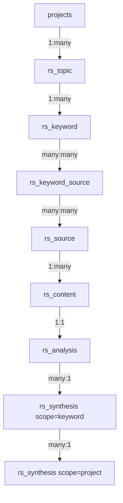

### The core pipeline (keep all of these):



**`rs_topic`** — The research topic. Belongs to a project. Has config (agent IDs, search settings). **Keep.**

**`rs_keyword`** — Search terms for a topic. Each gets independently searched. **Keep.**

**`rs_keyword_source`** — Join table. One URL can appear in results for multiple keywords. Stores rank per keyword. **Keep — this is correct many-to-many design.**

**`rs_source`** — A unique URL/webpage discovered during research. Has scrape status, inclusion flag, metadata from search results. **Keep.**

**`rs_content`** — Scraped text from a source. Versioned (re-scrape creates version 2, keeps version 1). Separate from source because: (a) content can be huge, (b) multiple versions, (c) different capture methods. **Keep — this is correct normalization.**

**`rs_analysis`** — Single-page LLM summary. One per content version. This is your "Tier A" — per-page agent output. **Keep.**

**`rs_synthesis`** — Multi-source LLM output. Currently has two scopes:
- `scope = 'keyword'` — combines all analyses for one keyword (Tier B)
- `scope = 'project'` — combines all keyword syntheses into the final report (Tier C)

Versioned, supports "update" mode (give agent previous version + new data). **Keep.**

### The extras:

**`rs_document`** — This was meant to be a "polished final document" assembled from the project synthesis + tag consolidations. Basically: take the Tier C synthesis, merge in any tag-specific consolidation sections, have an agent produce a publication-ready document.

**My honest take:** This is premature. The project-level synthesis (`rs_synthesis scope='project'`) already IS the final research document. Adding another LLM pass on top of it to "polish" it is an extra cost with minimal value. If you want a polished version, just use a better agent/prompt for the project synthesis.

**Recommendation: Drop `rs_document`.** The project-level synthesis is the final output. If you later want a "document export" feature, it can be a format transformation (markdown to PDF, etc.), not another LLM table.

**`rs_media`** — Stores images/videos extracted from scraped pages. Has its own table with url, alt_text, caption, dimensions, is_relevant flag.

**My honest take:** You asked if this could just be JSONB in the content row. It could. The `rs_content` table already has `extracted_images JSONB` and `extracted_links JSONB`. The separate `rs_media` table would only make sense if you need to query/filter media independently across sources (e.g., "show me all images from the entire topic" or "mark this image as relevant"). If the UI won't have that kind of media gallery view, it's overengineered.

**Recommendation: Drop `rs_media`.** The JSONB columns on `rs_content` (`extracted_images`, `extracted_links`) already exist and are sufficient. If you later need a media gallery, you can always extract them into a table.

**`rs_template`** — Pre-configured setups (keywords, tags, agent IDs, search params). Makes sense for "Company Research", "Medical Research", etc. **Keep.**

**`rs_source_keywords`** — This is a VIEW (not a table), created to make it easy for the frontend Supabase client to filter sources by keyword. **Keep — it's just a convenience view.**

---

## Summary of proposed changes

**Drop `project_id` column from:** `rs_keyword`, `rs_source`, `rs_content`, `rs_analysis`, `rs_synthesis`, `rs_tag`, `rs_media` (before dropping table), `rs_tag_consolidation` (before dropping table), `rs_document` (before dropping table)

**Drop entire tables:**
- `rs_document` — project synthesis is the final output
- `rs_tag_consolidation` — merge into `rs_synthesis` with `scope='tag'`
- `rs_media` — JSONB on `rs_content` is sufficient

**Simplify:**
- `rs_source_tag` — optionally drop `confidence`, `assigned_by` columns if auto-tagging isn't needed yet
- `rs_synthesis` — add optional `tag_id` column to support tag consolidation scope

**Final table count: 10 tables + 1 view** (down from 14 tables + 1 view)

```
rs_topic              — the research topic (has project_id)
rs_keyword            — search terms
rs_keyword_source     — keyword <-> source join
rs_source             — discovered URLs
rs_content            — scraped text (versioned)
rs_analysis           — per-page LLM summary
rs_synthesis          — all LLM syntheses (keyword, project, tag scopes)
rs_tag                — tag definitions
rs_source_tag         — source <-> tag join
rs_template           — reusable research templates
rs_source_keywords    — convenience VIEW for frontend
```

Do you want me to go ahead and create a detailed execution plan for these changes? And to confirm:

1. Drop `rs_document` — are you OK with project synthesis being the final output?
2. Drop `rs_media` — are you OK relying on the JSONB columns in `rs_content`?
3. `rs_source_tag` — do you want to keep `confidence`/`assigned_by` for future auto-tagging, or strip it to just (source_id, tag_id)?