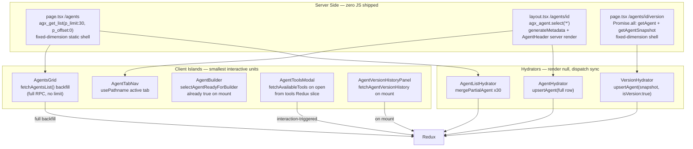

# Agents Route Full Implementation Plan

## Architecture Overview



## File Structure

```
app/(a)/agents/
├── layout.tsx                  # passthrough (no fetch)
├── page.tsx                    # SSR: agx_get_list(p_limit:30) → static shell + hydrator
├── loading.tsx                 # AgentListSkeleton (dimension-matched)
├── error.tsx                   # list error boundary ('use client')
└── [id]/
    ├── layout.tsx              # SSR: getAgent(id), generateMetadata, AgentHeader + AgentTabNav + AgentHydrator
    ├── page.tsx                # /agents/{id} — server shell + AgentViewContent client island
    ├── loading.tsx             # content area skeleton only (layout shell already real)
    ├── not-found.tsx           # triggered by notFound() in getAgent()
    ├── error.tsx               # agent detail error boundary ('use client')
    ├── edit/
    │   ├── page.tsx            # server shell + AgentBuilder client island (agentId prop)
    │   └── loading.tsx         # edit skeleton matching AgentBuilder dimensions
    ├── run/
    │   ├── page.tsx            # server shell + AgentRunPage client island (agentId prop)
    │   └── loading.tsx         # run skeleton
    ├── latest/
    │   ├── page.tsx            # server shell + AgentVersionHistoryPanel client island
    │   └── loading.tsx         # version history skeleton
    └── [version]/
        ├── page.tsx            # SSR parallel fetch: getAgent + getAgentSnapshot → AgentComparisonView
        └── loading.tsx         # three-panel skeleton matching comparison layout

features/agents/route/          # NEW — server components and hydrators wired to app/ routes
├── AgentHydrator.tsx           # 'use client', useRef guard, dispatch upsertAgent sync, renders null
├── AgentHeader.tsx             # Server Component, receives agent: AgentDefinition prop
├── AgentTabNav.tsx             # 'use client', usePathname for active tab, Link for each tab
├── AgentListHydrator.tsx       # 'use client', useRef guard, mergePartialAgent for each seed row
└── VersionHydrator.tsx         # 'use client', useRef guard, dispatch upsertAgent(snapshot)

features/agents/redux/tools/    # NEW — tools Redux slice
├── tools.slice.ts
├── tools.thunks.ts             # fetchAvailableTools — skips if status === 'succeeded'
└── tools.selectors.ts          # selectAllTools, selectToolsStatus, selectToolsReady

lib/agents/data.ts              # NEW — server-only data access, import 'server-only', all cache()-wrapped
```

## SSR Rules Applied (critical — do not deviate)

Every page follows this strict pattern from the skills:

1. **Server Component defines the fixed-dimension outer shell first.** `h-[calc(100dvh-var(--header-height))]` on the wrapper. Dimensions are locked before any data arrives.
2. **`<Suspense>` boundaries wrap only the async-data components** — not the whole page. The static shell (labels, layout, nav chrome) renders instantly outside any boundary.
3. **Skeletons are dimension-matched.** Every `loading.tsx` and every `<Suspense fallback>` has the same explicit height/width/padding as the real component. No content-derived sizing.
4. **`'use client'` only on the smallest interactive unit.** The page file itself is always a Server Component. Client components are islands inside server shells.
5. **Hydrators use `useRef` guard, not `useEffect`.** `useEffect` fires after paint — children would flash empty state. `useRef` dispatches during the first render pass.
6. **`cache()` deduplicates within a request.** `generateMetadata` and `layout` both call `getAgent(id)` — React collapses to one DB hit.
7. **Interaction-triggered fetching.** Tools are never fetched until the modal opens. Version history is never fetched until `/latest` mounts.
8. **`import 'server-only'`** at the top of `lib/agents/data.ts` — build fails if a Client Component accidentally imports it.

## New Data Layer — `lib/agents/data.ts`

```ts
import 'server-only'
import { cache } from 'react'
import { createClient } from '@/utils/supabase/server'
import { notFound } from 'next/navigation'
import { dbRowToAgentDefinition, versionSnapshotRowToAgentDefinition } from '@/features/agents/redux/agent-definition/converters'
import type { AgentDefinition } from '@/features/agents/types/agent-definition.types'

/**
 * SSR seed for the agents list page.
 * Uses the updated agx_get_list RPC which now accepts p_limit / p_offset.
 * p_limit: NULL → unlimited (original behavior). p_limit: 30 → first page.
 * Ordered: favorites first, then most recently updated.
 * Client then dispatches fetchAgentsList() (no limit) to backfill all agents.
 */
export const getAgentListSeed = cache(async () => {
  const supabase = await createClient()
  const { data, error } = await supabase.rpc('agx_get_list', {
    p_limit: 30,
    p_offset: 0,
  })
  if (error) throw error
  return (data ?? []) as AgentListRow[]
})

/**
 * Full live agent row. Wrapped in cache() so layout + generateMetadata + page
 * all call this — React deduplicates to one DB hit per request.
 * Calls notFound() directly on missing/unauthorized — triggers not-found.tsx.
 */
export const getAgent = cache(async (id: string): Promise<AgentDefinition> => {
  const supabase = await createClient()
  const { data, error } = await supabase
    .from('agx_agent')
    .select('*')
    .eq('id', id)
    .single()
  if (error || !data) notFound()
  return dbRowToAgentDefinition(data)
})

/**
 * Version snapshot for /agents/{id}/{version} comparison page.
 * Uses agx_get_version_snapshot RPC. Result is converted via
 * versionSnapshotRowToAgentDefinition (extracted from thunk into converters.ts)
 * so SSR and client thunk use identical mapping logic.
 */
export const getAgentSnapshot = cache(async (id: string, versionNumber: number): Promise<AgentDefinition> => {
  const supabase = await createClient()
  const { data, error } = await supabase.rpc('agx_get_version_snapshot', {
    p_agent_id: id,
    p_version_number: versionNumber,
  })
  if (error) notFound()
  const raw = Array.isArray(data) ? data[0] : data
  if (!raw) notFound()
  return versionSnapshotRowToAgentDefinition(id, raw)
})
```

## Converter Extraction

`versionSnapshotRowToAgentDefinition(agentId: string, row: AgentVersionSnapshot): AgentDefinition`

Extract the inline mapping from `fetchAgentVersionSnapshot` in `thunks.ts` into `converters.ts`. The thunk then calls this function before `dispatch(upsertAgent(...))`. SSR `getAgentSnapshot` calls the same function. One source of truth — no duplication. **Everything fetched must reach Redux via upsertAgent.**

## Tools Redux Slice — `features/agents/redux/tools/`

**`tools.slice.ts`** — state: `{ tools: DatabaseTool[], status: 'idle'|'loading'|'succeeded'|'failed', error: string|null }`

**`tools.thunks.ts`** — `fetchAvailableTools`:
```ts
// Skip if already loaded — interaction-triggered, no TTL needed
if (getState().tools.status === 'succeeded') return
// Query: supabase.from('tools').select('*').eq('is_active', true).order('category').order('name')
// Same query as ToolsService.fetchTools() — no service class needed
```

**`tools.selectors.ts`** — `selectAllTools`, `selectToolsStatus`, `selectToolsReady` (status === 'succeeded')

**`AgentToolsModal`** — `handleOpen` dispatches `fetchAvailableTools()`. Reads `availableTools` from `useAppSelector(selectAllTools)`. Props `availableTools?: DatabaseTool[]` removed from modal, manager, desktop, mobile, builder.

## Component-by-Component Detail

### `features/agents/route/AgentHydrator.tsx`
```tsx
'use client'
// useRef guard — dispatches during first render pass, not after paint
// dispatch(upsertAgent(definition)) — synchronous slice action
// Returns null — no UI
```

### `features/agents/route/AgentListHydrator.tsx`
```tsx
'use client'
// Receives seeds: AgentListRow[] (30 items from SSR)
// useRef guard — one pass, mergePartialAgent for each row + setAgentFetchStatus 'list'
// Returns null
```

### `features/agents/route/AgentHeader.tsx`
Server Component. Receives `agent: AgentDefinition`. Renders: agent name (h1), status badge, category badge. Fixed height (e.g. `h-14`). No Redux reads. Pure server HTML.

### `features/agents/route/AgentTabNav.tsx`
```tsx
'use client'
// TABS: [{ label: 'View', href: `/agents/${id}` }, { label: 'Edit', ... }, { label: 'Run', ... }, { label: 'Versions', href: `/agents/${id}/latest` }]
// usePathname() for active detection
// <Link> for each tab (cmd+click works)
// useTransition + startTransition for navigation feedback
```

### `features/agents/route/VersionHydrator.tsx`
```tsx
'use client'
// Receives snapshot: AgentDefinition (already converted, isVersion: true)
// useRef guard — dispatch(upsertAgent(snapshot))
// Returns null
```

## Page Implementation Details

### `/agents` — List Page

```tsx
// app/(a)/agents/page.tsx — Server Component
export default async function AgentsListPage() {
  const seeds = await getAgentListSeed()  // agx_get_list(p_limit:30)
  return (
    <div className="h-[calc(100dvh-var(--header-height))] flex flex-col overflow-hidden">
      {/* Hydrates 30 partial records into Redux — renders null */}
      <AgentListHydrator seeds={seeds} />
      {/* Static shell — dimensions locked */}
      <div className="flex-1 overflow-y-auto p-4 md:p-6">
        {/* AgentsGrid is a Client Component — its useEffect backfills all agents */}
        <AgentsGrid />
      </div>
    </div>
  )
}
```

`AgentsGrid` already calls `dispatch(fetchAgentsList())` in `useEffect`. The 30 seeded records show immediately (from Redux via `AgentListHydrator`). The full RPC backfill arrives and `mergePartialAgent` fills in the rest without wiping the seeded data.

`loading.tsx` — `AgentListSkeleton`: grid of `h-28` card skeletons matching `AgentCard` exact dimensions.

### `/agents/{id}` — Detail Layout

```tsx
// app/(a)/agents/[id]/layout.tsx — Server Component
export async function generateMetadata({ params }) {
  const { id } = await params
  const agent = await getAgent(id)  // cache() — same call as below, zero cost
  return { title: { template: '%s | AI Matrx', default: `${agent.name} | AI Matrx` }, description: agent.description }
}

export default async function AgentDetailLayout({ children, params }) {
  const { id } = await params
  const agent = await getAgent(id)  // cache() deduplicates with generateMetadata call

  return (
    <div className="h-[calc(100dvh-var(--header-height))] flex flex-col overflow-hidden">
      {/* Hydrates full agent into Redux — renders null, useRef guard */}
      <AgentHydrator definition={agent} />
      {/* Server-rendered header — fixed h-14, no JS */}
      <AgentHeader agent={agent} />
      {/* Client island — only usePathname + Link, thin */}
      <AgentTabNav agentId={id} />
      {/* Child pages stream in here */}
      <main className="flex-1 overflow-hidden">{children}</main>
    </div>
  )
}
```

### `/agents/{id}/edit` — Edit Page

```tsx
// Server Component — renders fixed shell, defers builder to client
export default async function AgentEditPage({ params }) {
  const { id } = await params
  return (
    <div className="h-full flex flex-col overflow-hidden">
      <AgentBuilder agentId={id} />  {/* Client Component — already hydrated */}
    </div>
  )
}
```

`AgentBuilder` — `selectAgentReadyForBuilder` is `true` on mount because layout already called `upsertAgent`. The `useEffect(fetchFullAgent)` guard is removed. Builders lazy-load via `next/dynamic`.

### `/agents/{id}/run` — Run Page

```tsx
export default async function AgentRunPage({ params }) {
  const { id } = await params
  return <AgentRunPage agentId={id} />  // Client Component, reads name from Redux
}
```

### `/agents/{id}/latest` — Version History Page

```tsx
// Server Component shell
export default async function AgentLatestPage({ params }) {
  const { id } = await params
  // getAgent already cached from layout — zero cost, just for type safety
  return (
    <div className="h-full flex flex-col overflow-hidden">
      {/* Client island — fetches agx_get_version_history on mount */}
      <AgentVersionHistoryPanel agentId={id} />
    </div>
  )
}
```

`AgentVersionHistoryPanel` — Client Component. Dispatches `fetchAgentVersionHistory({ agentId, limit: 50 })` on mount. Displays paginated version list. Clicking a version navigates to `/agents/{id}/{versionNumber}`.

### `/agents/{id}/{version}` — Snapshot Comparison Page

```tsx
// Server Component — parallel SSR fetch
export default async function AgentVersionPage({ params }) {
  const { id, version } = await params
  const versionNum = parseInt(version, 10)
  if (isNaN(versionNum)) notFound()

  // Parallel fetch — both start simultaneously
  const [agent, snapshot] = await Promise.all([
    getAgent(id),           // cached from layout — free
    getAgentSnapshot(id, versionNum),   // new DB hit — agx_get_version_snapshot
  ])

  return (
    <div className="h-full flex flex-col overflow-hidden">
      {/* Hydrates snapshot into Redux keyed by version_id */}
      <VersionHydrator snapshot={snapshot} />
      {/* Three-panel comparison — all data available server-side */}
      <AgentComparisonView liveAgent={agent} snapshot={snapshot} />
    </div>
  )
}
```

## `AgentComparisonView` Layout

Three vertical panels that **scroll in sync** (synchronized `scrollTop` via a shared scroll handler). Content within each panel is **field-aligned row by row** — same field appears at the same vertical position in all three panels.

```
┌─────────────────────────────────────────────────────────────┐
│  CHANGE SUMMARY BAR (fixed, horizontal)                     │
│  "5 fields changed: messages, settings, tools, modelId, …"  │
└─────────────────────────────────────────────────────────────┘
┌──────────────────┬──────────────────┬──────────────────────┐
│   CURRENT        │   VERSION {N}    │   DIFF               │
│  (live agx_agent)│  (snapshot)      │  (structured delta)  │
├──────────────────┼──────────────────┼──────────────────────┤
│  name: "Foo"     │  name: "Bar"     │  ● name changed      │
├──────────────────┼──────────────────┼──────────────────────┤
│  messages: [...]  │  messages: [...] │  message[0] modified │
│  (aligned rows)  │  (aligned rows)  │  +added / -removed   │
├──────────────────┼──────────────────┼──────────────────────┤
│  settings: {...} │  settings: {...} │  ● temperature: 0.7  │
│                  │                  │    → 0.9 changed      │
└──────────────────┴──────────────────┴──────────────────────┘
```

- **Change summary bar**: fixed-height horizontal strip at top. Lists changed fields by name with counts.
- **Three panels**: equal-width columns, synchronized vertical scroll.
- **Row alignment**: each logical "field row" spans all three columns at the same height. Variable-height rows (messages, settings) expand uniformly across all three columns.
- **Messages**: standard diff view — added lines green, removed lines red, context grey. Aligned by message index.
- **Settings / variable definitions / other structured data**: key-value comparison UI — each key is a row, changed values highlighted, added/removed keys marked.
- **Unchanged fields**: shown in muted styling so changed fields stand out.
- **No raw text diff** — all comparisons are structured per field type.

Fields compared: `name`, `description`, `modelId`, `messages`, `variableDefinitions`, `settings`, `tools`, `customTools`, `contextSlots`, `modelTiers`, `outputSchema`.

## `AgentSharedHeader` Refactor

Remove all `useAgentPageContext()` calls. The header becomes a standalone client component that accepts `agentId: string` as a prop.

```tsx
// Before (broken — requires Context):
const { agentId, agentName, basePath, mode } = useAgentPageContext()

// After (Redux + pathname):
const agentName = useAppSelector(state => selectAgentById(state, agentId)?.name ?? '')
const pathname = usePathname()
const mode: AgentPageMode = pathname.endsWith('/run') ? 'run' : 'edit'
const basePath = '/agents'  // hardcoded — no longer dynamic
```

The layout passes `agentId` to the header via `PageHeader` slot or directly. No Context needed.

## `AgentRunPage` Refactor

```tsx
// Remove: agentName prop
// Add: const agentName = useAppSelector(state => selectAgentById(state, agentId)?.name ?? '')
```

## Skeleton Rules (enforced on every loading.tsx)

- `AgentListSkeleton`: grid of cards, each `h-28 rounded-xl border animate-pulse`. Matches `AgentCard` bounding box.
- `AgentViewSkeleton`: content area skeleton. Same padding as view page. Fixed height.
- `AgentEditSkeleton`: two-column grid matching `AgentBuilderDesktop` layout (`grid-cols-2 gap-4 h-full`). Left: `h-10` + `flex-1` + `h-24`. Right: `h-10` + `flex-1`.
- `AgentRunSkeleton`: sidebar + main content split matching `AgentRunPage` layout.
- `AgentVersionHistorySkeleton`: list of `h-12` rows.
- `AgentComparisonSkeleton`: three equal columns with stacked `h-10` rows.

All skeletons use `<Skeleton>` component (Server Component, no `'use client'`).

## Cleanup

- Delete `app/(ssr)/ssr/agents/` (all files) after new routes verified
- Delete `features/agents/components/shared/AgentPageContext.tsx`
- Delete `features/agents/components/shared/AgentBuilderWrapper.tsx`
- Delete `features/agents/components/shared/AgentRunWrapper.tsx`
- `useAgentsBasePath` — routes are always `/agents` now; check all consumers and remove or simplify
- Remove `availableTools` prop from: `AgentBuilder`, `AgentBuilderDesktop`, `AgentBuilderMobile`, `AgentToolsModal`, `AgentToolsManager`
- `ToolsService` class in `utils/supabase/tools-service.ts` — query is inlined in the thunk; class can be deleted once thunk is wired
