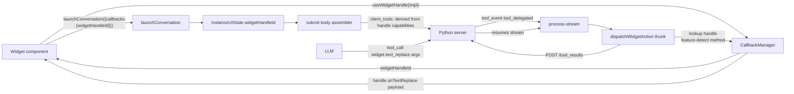

# Widget Handle + Client-Handled Tool System

## Architecture



**Two invariants:**

1. **A widget handle is the single source of truth for what the current widget can do.** The `client_tools` array on a request is derived from the handle's capabilities, so the model only sees what the widget actually supports.
2. **A widget tool is a real tool.** Same schema, same Python implementation, reusable server-side. "Client-handled" is a per-request routing decision, not a property of the tool.

---

## Phase 0 — Database: canonical widget tools

Add 10 rows to `public.tools` in the `automation-matrix` Supabase project (`txzxabzwovsujtloxrus`). These are the canonical widget capabilities. You will create Python duplicates later; for now `function_path` points to the planned Python module path so the DB row is future-proof.

Shared column conventions, matched to existing rows (`note_patch`, `text_analyze`):

- `category`: assigned per tool (see table below) — NOT grouped under a single `widget` category.
- `tags`: always include `widget-capable` so any widget/shortcut/applet selector can find them by tag. Additional tags per tool.
- `source_app`: `matrx_ai`.
- `semver`: `1.0.0`.
- `is_active`: `true`.
- `annotations`: MCP-style hints (`destructiveHint`, `idempotentHint`, `readOnlyHint`).
- `parameters`: matches the `note_patch` convention — object of `{ type, required?, description, enum?, default? }` keyed by param name. NOT a wrapping JSON-Schema `{type:object, properties:...}`.
- `output_schema`: standard JSON Schema object.
- `function_path`: `matrx_ai.tools.implementations.widgets.<name>` (Python team creates these).

Rows to insert (name, category, tags beyond `widget-capable`, short description):

- `widget_text_replace` — `text` — `[text,replace,write]` — "Replace the widget's currently-selected text with new text."
- `widget_text_insert_before` — `text` — `[text,insert,write]` — "Insert text immediately before the widget's current selection."
- `widget_text_insert_after` — `text` — `[text,insert,write]` — "Insert text immediately after the widget's current selection."
- `widget_text_prepend` — `text` — `[text,prepend,write]` — "Prepend text to the start of the widget's full content."
- `widget_text_append` — `text` — `[text,append,write]` — "Append text to the end of the widget's full content."
- `widget_text_patch` — `text` — `[text,patch,write]` — "Find-and-replace a verbatim excerpt inside the widget's content (fuzzy matching like `note_patch`). Args: `search_text`, `replacement_text`."
- `widget_update_field` — `productivity` — `[update,field,write]` — "Update a single named field on the widget's underlying record. Args: `field`, `value`."
- `widget_update_record` — `productivity` — `[update,record,write]` — "Patch multiple fields on the widget's underlying record. Args: `patch` (object)."
- `widget_attach_media` — `productivity` — `[media,attach,write]` — "Attach a media asset (image/video/audio) to the widget. Args: `url`, `mimeType`, optional `title`, `alt`, `position`."
- `widget_create_artifact` — `productivity` — `[artifact,create,write]` — "Create a new structured artifact owned by the widget (e.g. a flashcard, note, code block). Args: `kind`, `data`."

Deliberately excluded from the first wave (can be added later; `onComplete`/`onCancel`/`onError`/`onNavigate`/`onToast` are handled locally by the launch thunk or are not model-driven):

- `onComplete` → lifecycle, fired by launch thunk against the handle, not a tool.
- `onCancel` → user-driven, not a tool call the model should make.
- `onError` → dispatched by the resolver on tool failure, not a tool.
- `onNavigate`, `onToast` → we will add these as tools in wave 2 once the core path proves out.

Annotations per tool (all destructive widget mutations get `destructiveHint=true, idempotentHint=false`):

- All ten rows: `[{type:"destructiveHint",value:true},{type:"idempotentHint",value:false}]`.

### Full DDL/INSERT set

Documented in a new file [`features/agents/components/tools-management/WIDGET_TOOLS_SEED.sql`](features/agents/components/tools-management/WIDGET_TOOLS_SEED.sql) — contains the exact `INSERT` statements with full `parameters` and `output_schema` JSON for each of the 10 tools. This file is the handoff artifact for the Python team: same names, same schemas, they implement `function_path` server-side.

Output schema is identical across all widget write tools: `{ ok: boolean, applied?: string, reason?: "unsupported" | "failed" | "not_found", message?: string }`.

Insertion happens via `user-supabase` MCP `execute_sql` in a single transaction during implementation, after the SQL file is written and reviewed.

---

## Phase 1 — TypeScript types

### New file: [`features/agents/types/widget-handle.types.ts`](features/agents/types/widget-handle.types.ts)

Contains:

- `WidgetActionName` — string-literal union of the 10 tool names (`"widget_text_replace" | "widget_text_insert_before" | ...`). Sourced from a single const array `WIDGET_ACTION_NAMES` so iteration + typing stay in sync.
- `WidgetActionInput` — discriminated union mapping each action name to its argument shape. Shapes mirror the DB `parameters` column exactly (e.g. `widget_text_patch` takes `{ search_text, replacement_text }`).
- `WidgetActionResult` — `{ ok: true; applied?: string } | { ok: false; reason: "unsupported" | "failed" | "not_found"; message?: string; cause?: unknown }`.
- `WidgetHandle` — interface with all methods **optional**. Methods use the suffix name only (`onTextReplace`, `onTextInsertBefore`, `onTextPatch`, `onUpdateField`, `onUpdateRecord`, `onAttachMedia`, `onCreateArtifact`) plus non-tool lifecycle (`onComplete?`, `onCancel?`, `onError?`). Each method signature takes the typed payload for its corresponding action.
- `WIDGET_TOOL_NAME_TO_HANDLE_METHOD` — const map from tool name (`"widget_text_replace"`) → handle method key (`"onTextReplace"`). Used by the resolver.
- `deriveClientToolsFromHandle(handle: WidgetHandle): string[]` — pure helper. Returns the subset of the 10 tool names whose corresponding handle method is implemented. This is THE function that drives per-request capability negotiation.
- Payload types: `TextPatch`, `AttachedMedia`, `CreatedArtifact`.

### Modify: [`features/agents/types/conversation-invocation.types.ts`](features/agents/types/conversation-invocation.types.ts)

Replace the current `ConversationInvocationCallbacks` (which has per-action `*Id` fields from last turn) with:

```ts
export interface ConversationInvocationCallbacks {
  widgetHandleId?: string;
  originalText?: string;
}
```

Delete `onCompleteId`, `onTextReplaceId`, `onTextInsertBeforeId`, `onTextInsertAfterId`.

### Modify: [`features/agents/types/instance.types.ts`](features/agents/types/instance.types.ts)

- `InstanceUIStateRecord.callbackGroupId` → `widgetHandleId: string | null` (rename, same shape).
- `ManagedAgentOptions`: delete function-ref fields (`onComplete`, `onTextReplace`, `onTextInsertBefore`, `onTextInsertAfter`). Add `widgetHandleId?: string`. Keep `originalText?: string`.

---

## Phase 2 — CallbackManager extensions

Modify [`utils/callbackManager.ts`](utils/callbackManager.ts): add a typed helper `registerWidgetHandle(handle: WidgetHandle): string` that wraps `register(handle)` so call sites stay declarative and future refactors are localized.

No other changes — the ID-addressed `register` / `get` / `trigger` API from the previous turn's cleanup is sufficient.

---

## Phase 3 — `useWidgetHandle` React hook

New file: [`features/agents/hooks/useWidgetHandle.ts`](features/agents/hooks/useWidgetHandle.ts).

- Takes a `WidgetHandle` literal (the widget's method implementations).
- On first render, calls `callbackManager.registerWidgetHandle(handleRef)` and stashes the ID in a ref.
- Uses a ref-stable wrapper so the widget can pass fresh closures each render without re-registering.
- Returns `widgetHandleId: string`.
- On unmount, calls `callbackManager.unregister(id)`.
- Mirrors React's `useImperativeHandle` ergonomics.

This is what widget authors import. Usage:

```tsx
const widgetHandleId = useWidgetHandle({
  onTextReplace: (text) => setContent(text),
  onTextInsertBefore: (text) => setContent((c) => text + c),
  onComplete: (r) => toast.success("Done"),
});

<AgentButton
  invocation={{ agentId, callbacks: { widgetHandleId, originalText: selection } }}
/>
```

---

## Phase 4 — Launch + create-instance thunk refactor

### Modify: [`features/agents/redux/execution-system/thunks/launch-agent-execution.thunk.ts`](features/agents/redux/execution-system/thunks/launch-agent-execution.thunk.ts)

- Delete `registerCallbacks()` (lines 115–156) entirely.
- Replace the `onComplete?.(launchResult)` call (line 439) with:
  ```ts
  const handle = options.widgetHandleId
    ? callbackManager.get<WidgetHandle>(options.widgetHandleId)
    : null;
  handle?.onComplete?.(launchResult);
  ```
- After resolving `widgetHandleId`, derive the client-tool set: `const widgetClientTools = handle ? deriveClientToolsFromHandle(handle) : [];`. Merge with any existing `client_tools` the caller passed. Dispatch `setClientTools({ conversationId, tools: [...existing, ...widgetClientTools] })` immediately after `createInstance*` returns.
- Thread `widgetHandleId` (not `callbackGroupId`) through the three create-instance thunks.

### Modify: [`features/agents/redux/execution-system/thunks/launch-conversation.thunk.ts`](features/agents/redux/execution-system/thunks/launch-conversation.thunk.ts)

- Remove the `makeUnary` helper and all per-action callback forwarding. The adapter maps `callbacks.widgetHandleId` → `ManagedAgentOptions.widgetHandleId` and `callbacks.originalText` → `ManagedAgentOptions.originalText`. That's it.

### Modify: [`features/agents/redux/execution-system/thunks/create-instance.thunk.ts`](features/agents/redux/execution-system/thunks/create-instance.thunk.ts)

- All three create thunks (`createManualInstance`, `createInstanceFromShortcut`, `createManualInstanceNoAgent`) + both `startNewConversation*` thunks: rename arg + stored field `callbackGroupId` → `widgetHandleId`. Pass it into `initInstanceUIState`.

### Modify: [`features/agents/redux/execution-system/instance-ui-state/instance-ui-state.slice.ts`](features/agents/redux/execution-system/instance-ui-state/instance-ui-state.slice.ts) + [`instance-ui-state.selectors.ts`](features/agents/redux/execution-system/instance-ui-state/instance-ui-state.selectors.ts)

- Rename `callbackGroupId` → `widgetHandleId` on the record and every reducer that touches it.
- Add `selectWidgetHandleId(conversationId)` memoized selector.

---

## Phase 5 — Dispatcher thunk (the firing path)

### New file: [`features/agents/redux/execution-system/thunks/dispatch-widget-action.thunk.ts`](features/agents/redux/execution-system/thunks/dispatch-widget-action.thunk.ts)

Exports `dispatchWidgetAction({ conversationId, callId, toolName, args })`. Flow:

1. Look up `widgetHandleId` via `selectWidgetHandleId(conversationId)`.
2. `const handle = callbackManager.get<WidgetHandle>(widgetHandleId)`. If missing → result `{ ok:false, reason:"unsupported", message:"No widget handle registered" }`.
3. Map `toolName` → handle method via `WIDGET_TOOL_NAME_TO_HANDLE_METHOD`.
4. If the handle doesn't implement that method → `{ ok:false, reason:"unsupported" }`.
5. Wrap the call in try/catch. The handle method returns `void | Promise<void>`; we treat completion as `{ ok:true, applied:"<toolName>" }` and a throw as `{ ok:false, reason:"failed", message, cause }`.
6. Also fire `handle.onError?.(...)` on a failure (lifecycle parity).
7. Dispatch `submitToolResults({ conversationId, callId, toolName, result })` (new API helper — see Phase 6) regardless of outcome.
8. Also dispatch a local UI event so `toolLifecycle` in `active-requests.slice` flips the delegated call to `completed`/`error`. Reuse the existing `upsertToolLifecycle` action the stream already uses.

### Modify: [`features/agents/redux/execution-system/thunks/process-stream.ts`](features/agents/redux/execution-system/thunks/process-stream.ts)

In the `tool_delegated` branch (around line 507):

- If `toolData.tool_name` is in `WIDGET_ACTION_NAMES`, dispatch `dispatchWidgetAction(...)` and **do not** flip the instance to `"paused"`. Widget actions are fast and fire-and-forget from the stream's POV.
- For any other delegated tool name, keep the existing `setInstanceStatus({ status: "paused" })` behavior. This preserves the current contract for non-widget delegated tools (future-proof).

---

## Phase 6 — `POST /tool_results` client

### New file: [`features/agents/api/submit-tool-results.ts`](features/agents/api/submit-tool-results.ts)

- Function `submitToolResults({ conversationId, results })` posts to `/ai/conversations/{conversationId}/tool_results`.
- `results` is an array of `{ call_id, tool_name, output?, is_error?, error_message? }` matching the `CLIENT_SIDE_TOOLS.md` contract exactly.
- Uses `callApi` from [`lib/api/call-api.ts`](lib/api/call-api.ts) with the already-typed path `/ai/conversations/{conversation_id}/tool_results`.
- Handles the `404 not_found` response by logging a warning (possible duplicate POST or expired call — not a fatal error; the stream stays alive).
- Exposed through a tiny thunk `submitToolResults.thunk.ts` that also patches the active-request's tool lifecycle on success.

---

## Phase 7 — Consumer migrations (no dual-path, clean landing)

Every caller that currently passes `onComplete`/`onTextReplace`/`onTextInsertBefore`/`onTextInsertAfter` to the launcher/invocation must migrate to `useWidgetHandle`. Confirmed call sites from the prior grep pass:

- [`features/agents/hooks/useAgentLauncher.ts`](features/agents/hooks/useAgentLauncher.ts)
- [`features/agents/hooks/useAgentLauncherTester.ts`](features/agents/hooks/useAgentLauncherTester.ts)
- [`features/agents/components/builder/AgentBuilderRightPanel.tsx`](features/agents/components/builder/AgentBuilderRightPanel.tsx)
- [`features/agents/agent-creators/interactive-builder/agent-generator.constants.ts`](features/agents/agent-creators/interactive-builder/agent-generator.constants.ts)
- Text-shortcut callers under `features/prompts/**` (several hits from the earlier grep) that wire `onTextReplace`/`onTextInsertBefore`/`onTextInsertAfter` for the `UnifiedContextMenu` flow — e.g. [`features/prompts/components/smart/SmartPromptInput.tsx`](features/prompts/components/smart/SmartPromptInput.tsx), [`features/prompts/components/results-display/PromptRunner.tsx`](features/prompts/components/results-display/PromptRunner.tsx), [`features/prompts/components/smart/SmartPromptRunner.tsx`](features/prompts/components/smart/SmartPromptRunner.tsx), [`features/prompts/components/results-display/ContextAwarePromptRunner.tsx`](features/prompts/components/results-display/ContextAwarePromptRunner.tsx), [`features/prompts/examples/ContextMenuExample.tsx`](features/prompts/examples/ContextMenuExample.tsx), [`features/prompts/components/configuration/SystemMessage.tsx`](features/prompts/components/configuration/SystemMessage.tsx), [`features/prompts/components/dynamic/PromptExecutionCard.tsx`](features/prompts/components/dynamic/PromptExecutionCard.tsx). Each gets a `useWidgetHandle({ onTextReplace, onTextInsertBefore, onTextInsertAfter })` and passes the returned id.
- [`features/context-menu/UnifiedContextMenu.tsx`](features/context-menu/UnifiedContextMenu.tsx) — central integration point that currently passes these three callbacks down through `openPrompt`. Refactor it to accept a `widgetHandle` literal and register once.
- Legacy [`lib/redux/thunks/openPromptExecutionThunk.ts`](lib/redux/thunks/openPromptExecutionThunk.ts) — if it still accepts the old callbacks, either retire it (preferred — another grep showed it's deprecated) or migrate it to `widgetHandleId`.

Each migration also updates type imports and drops the old callback destructuring.

---

## Phase 8 — Legacy shims + docs

- [`features/agents/redux/legacy-shims/cx-message-actions-selectors.ts`](features/agents/redux/legacy-shims/cx-message-actions-selectors.ts) — audit for any reference to `callbackGroupId` and rename.
- [`features/agents/conversation-invocation-reference.md`](features/agents/conversation-invocation-reference.md) — rewrite the callbacks section to describe `widgetHandleId` only.
- [`features/agents/components/tools-management/CLIENT_SIDE_TOOLS.md`](features/agents/components/tools-management/CLIENT_SIDE_TOOLS.md) — append a "Widget Actions" section explaining that the `widget_*` tool family is the canonical way widgets expose capabilities, and that `client_tools` is auto-derived from the registered `WidgetHandle`.
- New file [`features/agents/components/tools-management/WIDGET_TOOLS_SEED.sql`](features/agents/components/tools-management/WIDGET_TOOLS_SEED.sql) — full INSERT statements for the 10 rows.
- New file [`features/agents/docs/WIDGET_HANDLE_SYSTEM.md`](features/agents/docs/WIDGET_HANDLE_SYSTEM.md) — end-to-end diagram + copy-pasteable widget example.

---

## Phase 9 — Typecheck + smoke tests

- `pnpm tsc --noEmit` must pass — the rename surfaces every caller.
- Smoke tests (manual, documented in `WIDGET_HANDLE_SYSTEM.md`):
  - **Text-shortcut flow:** run an existing `UnifiedContextMenu` "replace selection" shortcut against a real agent that issues `widget_text_replace`. Verify the selection is replaced, the tool-result POST lands, and the AI loop continues.
  - **Lifecycle flow:** run an `autoRun=true, displayMode:"direct"` launch and verify `onComplete` fires on the widget handle (no widget tool involved).
  - **Unsupported method:** register a widget handle with only `onTextReplace`; have the agent call `widget_attach_media`; verify the POST returns `is_error:false, output:{ ok:false, reason:"unsupported" }` and the stream completes cleanly.
  - **Error path:** throw from `onTextReplace`; verify the POST carries the failure, the tool lifecycle flips to `error`, and `handle.onError` fires.
  - **No handle registered:** launch with no `widgetHandleId`; verify the `client_tools` array is empty, the agent never sees widget tools, and nothing regresses.

---

## Open items confirmed closed

- **Submit body assembler:** already forwards `client_tools` from `instanceClientTools` slice (confirmed in [`execute-instance.thunk.ts`](features/agents/redux/execution-system/thunks/execute-instance.thunk.ts) and [`execute-chat-instance.thunk.ts`](features/agents/redux/execution-system/thunks/execute-chat-instance.thunk.ts)). No change needed there beyond Phase 4's `setClientTools` dispatch.
- **tool_results endpoint typed:** already in `lib/api/call-api.ts` path extraction; need a thin helper, not new OpenAPI types.
- **tool_delegated stream handling:** already wired; Phase 5 just adds a branch for `widget_*` names.

## What we are explicitly NOT doing (to keep this one PR)

- Adding `execution_side` column to `public.tools` (called out as an open question in the doc). Current design derives client-handled status from the handle, per request, which is exactly what the doc recommends today.
- Inline `custom_tools`. All widget tools are DB-registered.
- Wave-2 tools (`widget_navigate`, `widget_toast`, `widget_undo`, `widget_redo`, `widget_focus`) — trivial to add later under the same contract once the core is proven.
- Changing any non-agent code paths.