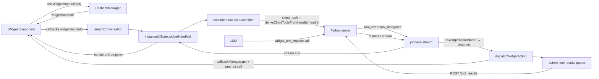

# Widget Handle + Client-Handled Tool System

A widget that wants an agent to mutate its state — replace a selection, update
a field, attach media, create an artifact — does it through **one object**:
`WidgetHandle`. The launch path reads the handle per-turn to decide which
`widget_*` tools to advertise; when the model invokes one, a dispatcher routes
it to the matching method and posts the result back to the server so the
stream resumes.

## At a glance



## Two invariants

1. **The widget handle is the single source of truth for what the current
   widget can do.** `client_tools` is derived from the handle's methods on
   every turn, so the model only sees what the widget actually supports — and
   capability changes between turns (feature flags, re-mounts, new widget
   attached to a rehydrated conversation) are picked up automatically.
2. **A widget tool is a real tool.** Same schema, same Python implementation,
   reusable server-side. "Client-handled" is a per-request routing decision
   (the client adds the name to `client_tools`), not a property of the tool.

## The 10 canonical widget_* tools

Seeded in `public.tools` via
[`WIDGET_TOOLS_SEED.sql`](../components/tools-management/WIDGET_TOOLS_SEED.sql).
All ten share: `source_app=matrx_ai`, `tag=widget-capable`,
`annotations=[destructiveHint:true, idempotentHint:false]`, output schema
`{ok, applied?, reason?, message?}`.

| Tool | Category | Args | Handle method |
|---|---|---|---|
| `widget_text_replace` | text | `text` | `onTextReplace` |
| `widget_text_insert_before` | text | `text` | `onTextInsertBefore` |
| `widget_text_insert_after` | text | `text` | `onTextInsertAfter` |
| `widget_text_prepend` | text | `text` | `onTextPrepend` |
| `widget_text_append` | text | `text` | `onTextAppend` |
| `widget_text_patch` | text | `search_text`, `replacement_text` | `onTextPatch` |
| `widget_update_field` | productivity | `field`, `value` | `onUpdateField` |
| `widget_update_record` | productivity | `patch` (object) | `onUpdateRecord` |
| `widget_attach_media` | productivity | `url`, `mimeType`, `title?`, `alt?`, `position?` | `onAttachMedia` |
| `widget_create_artifact` | productivity | `kind`, `data` | `onCreateArtifact` |

Python implementations live at `matrx_ai.tools.implementations.widgets.*`
(owned by the Python team; same schemas as the DB rows).

## Writing a widget

```tsx
import { useWidgetHandle } from "@/features/agents/hooks/useWidgetHandle";
import { useAgentLauncher } from "@/features/agents/hooks/useAgentLauncher";
import type { WidgetHandle } from "@/features/agents/types/widget-handle.types";

function MyNoteEditor({ noteId }: { noteId: string }) {
  const [content, setContent] = useState("");
  const [selection, setSelection] = useState("");

  const widgetHandleId = useWidgetHandle({
    onTextReplace: ({ text }) => {
      setContent((c) => c.replace(selection, text));
    },
    onTextInsertBefore: ({ text }) => {
      setContent((c) => c.replace(selection, text + selection));
    },
    onTextInsertAfter: ({ text }) => {
      setContent((c) => c.replace(selection, selection + text));
    },
    onTextPatch: ({ search_text, replacement_text }) => {
      setContent((c) => c.replace(search_text, replacement_text));
    },
    onUpdateField: ({ field, value }) => {
      if (field === "body") setContent(String(value));
    },
    onComplete: ({ responseText }) => {
      toast.success(`Done: ${responseText?.slice(0, 40)}`);
    },
    onError: ({ reason, message }) => {
      toast.error(`${reason}: ${message}`);
    },
  });

  const { launchShortcut } = useAgentLauncher();

  const runRewrite = () => {
    launchShortcut(
      "rewrite-concise-shortcut-id",
      { selection, content },
      {
        widgetHandleId,
        originalText: selection,
        displayMode: "inline",
        autoRun: true,
      },
    );
  };

  return <textarea value={content} onChange={...} />;
}
```

## The contract in detail

### WidgetHandle

Every method is **optional**. The subset you implement determines which
`widget_*` tools the agent sees. Methods receive typed payloads:

```ts
interface WidgetHandle {
  onTextReplace?: ({ text }) => void | Promise<void>;
  onTextInsertBefore?: ({ text }) => void | Promise<void>;
  onTextInsertAfter?: ({ text }) => void | Promise<void>;
  onTextPrepend?: ({ text }) => void | Promise<void>;
  onTextAppend?: ({ text }) => void | Promise<void>;
  onTextPatch?: ({ search_text, replacement_text }) => void | Promise<void>;
  onUpdateField?: ({ field, value }) => void | Promise<void>;
  onUpdateRecord?: ({ patch }) => void | Promise<void>;
  onAttachMedia?: ({ url, mimeType, title?, alt?, position? }) => void | Promise<void>;
  onCreateArtifact?: ({ kind, data }) => void | Promise<void>;

  onComplete?: ({ conversationId, requestId?, responseText? }) => void;
  onCancel?: () => void;
  onError?: ({ reason, message?, cause? }) => void;
}
```

### Lifecycle firing sites

| Event | Where it fires |
|---|---|
| `onTextReplace`, `onTextInsertBefore`, ... | `dispatchWidgetAction.thunk.ts` — when a `tool_delegated` event with a `widget_*` tool_name arrives |
| `onComplete` | `process-stream.ts` at stream-end (every display mode — not just autoRun/direct) |
| `onError` | `dispatchWidgetAction` on action failure + `process-stream.ts` on stream-level errors |
| `onCancel` | Not yet wired to a trigger — reserved for future "user aborted" integration |

### Error semantics

The dispatcher covers four cases:

| Situation | Result returned to server | Lifecycle fired |
|---|---|---|
| No widget handle registered | `{ok:false, reason:"not_found"}` | none |
| Handle is missing the tool's method | `{ok:false, reason:"unsupported"}` | `onError({reason:"unsupported"})` |
| Method throws | `{ok:false, reason:"failed", message, cause}` | `onError({reason:"failed"})` |
| Method resolves | `{ok:true, applied:toolName}` | none |

Every outcome POSTs to `/ai/conversations/{id}/tool_results` — the server
always resumes the loop.

### Concurrency: the microtask batcher

Multiple `widget_*` tools in one iteration resolve in the same JS tick. The
dispatcher enqueues results into
[`submit-tool-results.ts`](../api/submit-tool-results.ts); a
`queueMicrotask` flush coalesces them into **one POST per conversationId**
with `results: [...]`. The endpoint contract natively supports batching.

### Unmount mid-stream

`useWidgetHandle` unregisters on unmount. If the widget disappears while a
`widget_*` is delegated, `callbackManager.get(widgetHandleId)` returns
undefined, the dispatcher posts `{ok:false, reason:"not_found"}`, and the
stream completes gracefully instead of timing out at 120s.

## Per-turn derivation (the important bit)

`execute-instance.thunk.ts` and `execute-chat-instance.thunk.ts` read the
handle live every time they assemble a request body:

```ts
const widgetHandleId = selectWidgetHandleIdFor(state, conversationId);
const widgetHandle = widgetHandleId
  ? callbackManager.get<WidgetHandle>(widgetHandleId)
  : null;
const widgetClientTools = deriveClientToolsFromHandle(widgetHandle);
```

This solves three problems the naive "set `client_tools` once at launch"
design has:

1. **Rehydrated conversations.** `loadConversation.thunk.ts` doesn't init
   `instanceClientTools`. The first design lost widget capabilities on turn
   2+ of a reopened conversation. Per-turn derivation picks up whatever
   widget is attached at submit-time.
2. **Mid-conversation capability changes.** A widget that gains
   `onAttachMedia` after the first turn (feature flag, user action) will see
   that tool in turn 2 without re-launching.
3. **Capability downgrades.** A widget that stops accepting a method (e.g.
   read-only view) no longer offers it on the next turn.

The `instanceClientTools` slice still holds non-widget client tools (custom
inline tools, future per-request delegation).

## Endpoint contract summary

All three streaming endpoints accept `client_tools: string[]`:

- `POST /ai/manual` · `POST /ai/agent/{id}` · `POST /ai/conversation/{id}`

Server emits `tool_event` with `event:"tool_delegated"`; the client replies
via `POST /ai/conversations/{conversation_id}/tool_results`:

```ts
{
  results: Array<{
    call_id: string;
    tool_name: string;
    output?: unknown;
    is_error?: boolean;
    error_message?: string;
  }>
}
```

Full contract: [`CLIENT_SIDE_TOOLS.md`](../components/tools-management/CLIENT_SIDE_TOOLS.md).

## Smoke tests

Documented in the plan file. Summary:

1. Text-shortcut flow against a real agent emitting `widget_text_replace`.
2. `handle.onComplete` fires on interactive modes (modal-full, sidebar, panel), not only direct/autoRun.
3. Unsupported method — agent calls `widget_attach_media` on a handle with only `onTextReplace`; verify POST carries `{ok:false, reason:"unsupported"}` and stream completes.
4. Thrown method — `onTextReplace` throws; verify `{ok:false, reason:"failed"}` POST + `handle.onError` fires.
5. No handle registered — `client_tools` in request body is empty; agent never sees widget tools.
6. Mid-stream unmount — `callbackManager.get(id)` returns undefined; dispatcher posts `not_found`; stream resumes.
7. Concurrent widget calls — two `widget_*` in one iteration produce ONE POST with `results: [...,...]` (microtask batch).
8. Rehydrated conversation — reopen a past conversation via `loadConversation`, attach a widget, verify the next turn carries the derived `client_tools`.
9. Capability change — widget adds a method between turns; verify the new tool appears in the next request.

## Migration notes (from the legacy callback system)

Before this system, consumers wired four function refs on invocation
callbacks — `onComplete`, `onTextReplace`, `onTextInsertBefore`,
`onTextInsertAfter` — through `CallbackManager` groups, and a parallel set
of `*Id` slots on `ConversationInvocation.callbacks`.

That's gone. Replaced by:

| Before | After |
|---|---|
| `callbacks.onCompleteId`, `onTextReplaceId`, `onTextInsertBeforeId`, `onTextInsertAfterId`, `originalText` | `callbacks.widgetHandleId`, `originalText` |
| `ManagedAgentOptions.onComplete`, `onTextReplace`, `onTextInsertBefore`, `onTextInsertAfter` | `ManagedAgentOptions.widgetHandleId` |
| `InstanceUIState.callbackGroupId` | `InstanceUIState.widgetHandleId` |
| `callbackManager.createGroup()` + `registerWithContext()` per callback | `callbackManager.registerWidgetHandle(handle)` once |
| `callbackManager.removeGroup(id)` on destroyInstance | `callbackManager.unregister(id)` |
| `onComplete` fires only in autoRun/direct/background/inline branch | `handle.onComplete` fires at stream end (all display modes) |

The legacy prompts overlay system (`features/prompts/**`,
`features/context-menu/**`, etc.) has its own separate `onTextReplace`
plumbing independent of `ManagedAgentOptions` — it was not migrated here. If
and when it moves to the agent execution system, it'll adopt the
`useWidgetHandle` pattern too.
