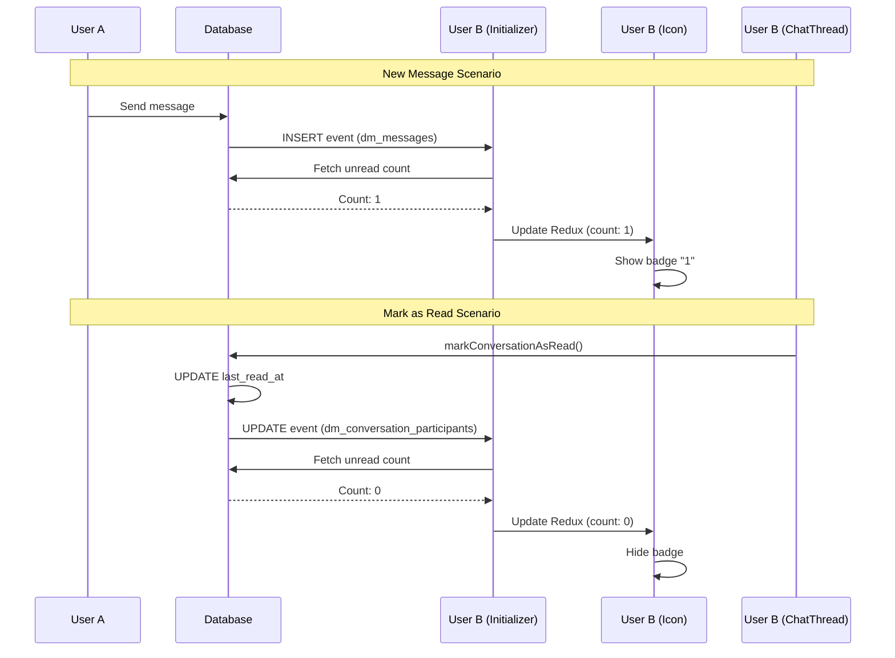

# Direct Messaging System

Real-time user-to-user messaging for AI Matrx using Supabase Realtime.

## Features

- **Direct Messages**: One-on-one conversations between users
- **Group Messages**: Multi-user conversations (future)
- **Real-time Updates**: Instant message delivery via broadcast + postgres_changes
- **Typing Indicators**: Live "user is typing" status
- **Online Presence**: Track who's currently viewing a conversation
- **Unread Counts**: Badge showing unread message count
- **Message Status**: Sending, sent, delivered, read, failed states
- **Optimistic Updates**: Messages appear instantly before server confirmation
- **Adjustable Side Sheet**: Resizable panel (like Canvas)
- **Full Page View**: Dedicated `/messages` route

## Architecture

### Next.js Routing Structure

The messaging system uses proper Next.js App Router patterns with dynamic routing:

```
app/(authenticated)/messages/
├── layout.tsx              # Shared layout with persistent desktop sidebar
├── page.tsx                # Conversation list (mobile full-screen, desktop empty state)
└── [conversationId]/
    └── page.tsx            # Chat thread view
```

**Key Features:**
- **Desktop**: Persistent sidebar showing conversation list across all routes
- **Mobile**: Full-screen route transitions between list and chat
- **Deep Linking**: Share direct links to conversations (`/messages/[id]`)
- **Browser Navigation**: Back/forward buttons work correctly
- **Loading States**: `useTransition` for smooth navigation with loading indicators

**Navigation Pattern:**
```tsx
// Use Next.js router, NOT Redux
const router = useRouter();
const [isPending, startTransition] = useTransition();

const handleSelectConversation = (conversationId: string) => {
  startTransition(() => {
    router.push(`/messages/${conversationId}`);
  });
};
```

### Database Schema

All tables use `dm_` prefix to avoid conflicts. User references use `auth.users(id)` UUID.

```
dm_conversations
├── id (UUID, PK)
├── type (dm_conversation_type: 'direct' | 'group')
├── group_name (TEXT)
├── group_image_url (TEXT)
├── created_by (UUID → auth.users)
├── created_at (TIMESTAMPTZ)
└── updated_at (TIMESTAMPTZ)

dm_conversation_participants
├── id (UUID, PK)
├── conversation_id (UUID → dm_conversations)
├── user_id (UUID → auth.users)
├── role (dm_participant_role: 'owner' | 'admin' | 'member')
├── joined_at (TIMESTAMPTZ)
├── last_read_at (TIMESTAMPTZ)
├── is_muted (BOOLEAN)
└── is_archived (BOOLEAN)

dm_messages
├── id (UUID, PK)
├── conversation_id (UUID → dm_conversations)
├── sender_id (UUID → auth.users)
├── content (TEXT)
├── message_type (dm_message_type)
├── media_url, media_thumbnail_url, media_metadata
├── status (dm_message_status)
├── reply_to_id (UUID → dm_messages)
├── deleted_at (TIMESTAMPTZ)
├── deleted_for_everyone (BOOLEAN)
├── created_at, edited_at (TIMESTAMPTZ)
└── client_message_id (TEXT, for deduplication)
```

### Key SQL Functions

- `is_dm_participant(user_id, conversation_id)` - Check participation
- `get_dm_unread_count(user_id, conversation_id)` - Get unread count
- `get_dm_user_info(user_id)` - Get user info from auth.users
- `get_dm_conversations_with_details(user_id)` - List conversations with metadata
- `find_dm_direct_conversation(user1_id, user2_id)` - Find existing direct chat

### Real-time Architecture

```
┌─────────────────┐
│  React Component │
│  (ChatThread)    │
└────────┬────────┘
         │
         ▼
┌─────────────────┐
│   useChat Hook   │  ← Combines: useMessages, useTypingIndicator, useOnlinePresence
└────────┬────────┘
         │
         ▼
┌─────────────────┐
│ MessagingService │  ← Singleton managing all channels
│   (lib/supabase) │
└────────┬────────┘
         │
    ┌────┴────┐
    ▼         ▼
┌───────┐ ┌─────────────────┐
│Broadcast│ │postgres_changes │
│(fast)   │ │(reliable)       │
└───────┘ └─────────────────┘
```

**Dual Subscription Pattern:**
1. **Broadcast** - Immediate delivery when sender broadcasts
2. **postgres_changes** - Reliable fallback via database INSERT trigger

**Deduplication:** Uses `client_message_id` to prevent duplicates when both channels deliver the same message.

## Usage

### 1. Database Setup

Run the migration in Supabase SQL Editor:
```sql
-- See: supabase/migrations/20260130200000_messaging.sql
```

### 2. Import Components

```tsx
import {
  MessagingSideSheet,
  MessagingInitializer,
  MessageIcon,
} from '@/features/messaging';
```

### 3. Global Setup (Already Integrated)

The authenticated layout includes:
- `<MessagingInitializer />` - Loads conversations on mount
- `<MessagingSideSheet />` - Side panel UI

The header includes:
- `<MessageIcon />` - Toggle button with unread badge

### 4. Use Hooks Directly

```tsx
import { useChat, useConversations } from '@/hooks/useSupabaseMessaging';

// In your component
const userId = user?.id; // auth.users.id UUID
const displayName = user?.userMetadata?.fullName || 'User';

const {
  messages,
  sendMessage,
  typingUsers,
  setTyping,
  onlineUsers,
} = useChat(conversationId, userId, displayName);

const {
  conversations,
  createConversation,
  refreshConversations,
} = useConversations(userId);
```

### 5. Navigation

**Use Next.js Router for navigation (NOT Redux):**

```tsx
import { useRouter } from 'next/navigation';
import { useTransition } from 'react';

const router = useRouter();
const [isPending, startTransition] = useTransition();

// Navigate to a conversation
const handleSelectConversation = (conversationId: string) => {
  startTransition(() => {
    router.push(`/messages/${conversationId}`);
  });
};
```

**Redux State (for UI only):**

```tsx
import { useAppDispatch, useAppSelector } from '@/lib/redux';
import {
  openMessaging,
  closeMessaging,
  selectTotalUnreadCount,
} from '@/features/messaging';

// Open/close side sheet
dispatch(openMessaging());
dispatch(closeMessaging());

// Get unread count for header badge
const unreadCount = useAppSelector(selectTotalUnreadCount);
```

**Important:** Redux should only manage UI state (side sheet open/close, unread counts). Use URL-based routing for navigation, not Redux state.

## API Routes

| Method | Route | Description |
|--------|-------|-------------|
| GET | `/api/messages/conversations` | List user's conversations |
| POST | `/api/messages/conversations` | Create conversation (or return existing) |
| GET | `/api/messages/conversations/[id]` | Get conversation details |
| PUT | `/api/messages/conversations/[id]` | Update settings (mute, archive) |
| DELETE | `/api/messages/conversations/[id]` | Leave/delete conversation |
| GET | `/api/messages/[conversationId]/messages` | List messages (paginated) |
| POST | `/api/messages/[conversationId]/messages` | Send message |
| GET | `/api/messages/[conversationId]/messages/[id]` | Get single message |
| PATCH | `/api/messages/[conversationId]/messages/[id]` | Edit/delete message |
| DELETE | `/api/messages/[conversationId]/messages/[id]` | Soft delete message |

## File Structure

```
features/messaging/
├── index.ts                    # Barrel exports
├── types.ts                    # TypeScript types
├── README.md                   # This file
├── redux/
│   └── messagingSlice.ts       # Redux state
└── components/
    ├── MessagingSideSheet.tsx  # Main side panel
    ├── MessagingInitializer.tsx # Data loader
    ├── ConversationList.tsx    # Conversation list
    ├── ChatThread.tsx          # Message thread
    ├── MessageBubble.tsx       # Single message
    ├── MessageInput.tsx        # Input field
    ├── TypingIndicator.tsx     # "X is typing..."
    ├── OnlineIndicator.tsx     # Green/gray dot
    ├── NewConversationDialog.tsx # User search
    └── MessageIcon.tsx         # Header icon

lib/supabase/messaging.ts       # MessagingService singleton
hooks/useSupabaseMessaging.ts   # React hooks

app/api/messages/               # API routes
app/(authenticated)/messages/   # Page routes
```

## Key Patterns

### Next.js Routing (New Pattern)

**Proper Component Lifecycle:**
- Components unmount/remount correctly when navigating between routes
- Real-time subscriptions are properly cleaned up on unmount
- No stale subscriptions or memory leaks

**Layout Structure:**
```tsx
// messages/layout.tsx
<div className="flex h-full">
  {/* Desktop sidebar - always visible */}
  <div className="hidden md:flex w-80">
    <ConversationList />
  </div>
  
  {/* Main content - route outlet */}
  <div className="flex-1">
    {children}
  </div>
</div>
```

**Benefits:**
- ✅ Shareable conversation URLs
- ✅ Browser back/forward works
- ✅ Proper component lifecycle
- ✅ Real-time features work reliably
- ✅ Better mobile UX with native route transitions

### Singleton MessagingService

One instance manages all Supabase channels. Prevents duplicate subscriptions.

```tsx
const service = getMessagingService();
service.subscribeToMessages(convId, onMessage);
// cleanup
service.removeChannel(convId);
```

### Optimistic Updates

Messages appear immediately with `status: 'sending'`, then update on confirmation:

```tsx
// 1. Add optimistic message
setMessages(prev => [...prev, optimisticMessage]);

// 2. Send to server
await messagingService.sendMessage(...);

// 3. Real-time updates replace optimistic with confirmed
```

### Typing Indicator with Auto-timeout

```tsx
const handleTyping = () => {
  setTyping(true);
  // Auto-stops after 3 seconds of no input
};
```

### Presence Tracking

Uses Supabase Presence API to track who's currently viewing a conversation.

## Security

- **RLS Policies**: All operations require user to be conversation participant
- **SECURITY DEFINER functions**: Prevent RLS recursion issues
- **Soft Delete**: Messages are marked deleted, not removed
- **UUID References**: Uses `auth.users(id)` for all user references

## Real-time Features

### Typing Indicators

Shows when other users are typing in real-time. Uses Supabase Presence API.

**How it works:**
1. User starts typing → `setTyping(true)` called
2. Presence state updated via Supabase channel
3. Other users see "User is typing..." within 1 second
4. Auto-stops after 3 seconds of no typing

**Requirements for proper function:**
- Proper component lifecycle (unmount/remount)
- Clean channel subscriptions
- Next.js routing (not Redux-based navigation)

### Online Presence

Tracks which users are currently viewing the conversation.

**How it works:**
1. User opens conversation → Presence tracked
2. Green dot shown for online users
3. User navigates away → Presence untracked
4. Offline status shown within 5-10 seconds

**Requirements:**
- `useOnlinePresence` hook subscribes on mount
- Unsubscribes on unmount (proper cleanup)
- Separate presence channel per conversation

### Message Delivery

Dual subscription pattern for reliability:

1. **Broadcast** (immediate): Sender broadcasts to channel
2. **postgres_changes** (reliable): Database INSERT triggers update

**Deduplication:** Uses `client_message_id` to prevent duplicates.

### Unread Count Tracking

Real-time unread count badge in the header message icon.

**How it works:**

1. **Initial Load**: `MessagingInitializer` fetches total unread count on mount
2. **New Messages**: Listens for INSERT on `dm_messages` → refetches count
3. **Mark as Read**: Listens for UPDATE on `dm_conversation_participants` → refetches count
4. **Display**: `MessageIcon` shows badge with count from Redux state

**Auto-Mark as Read:**
- When `ChatThread` mounts → marks conversation as read
- When new message arrives from other user → marks as read immediately
- Updates `last_read_at` timestamp in database
- Triggers real-time update for all connected clients

**Database Calculation:**
```sql
-- Unread count = messages created after user's last_read_at
SELECT COUNT(*) 
FROM dm_messages m
WHERE m.conversation_id = ? 
  AND m.created_at > participant.last_read_at
  AND m.sender_id != current_user_id
```

**Real-time Flow:**


**Key Components:**

1. **MessagingInitializer** (`features/messaging/components/MessagingInitializer.tsx`)
   - Subscribes to global dm_messages INSERT events
   - Subscribes to dm_conversation_participants UPDATE events
   - Fetches and updates total unread count in Redux

2. **MessageIcon** (`features/messaging/components/MessageIcon.tsx`)
   - Displays badge with unread count from Redux
   - Shows "99+" for counts over 99
   - Red badge for visibility

3. **ChatThread** (`features/messaging/components/ChatThread.tsx`)
   - Automatically marks conversation as read on mount
   - Marks as read when receiving new messages
   - Uses `autoMarkAsRead: true` option

4. **Redux State** (`features/messaging/redux/messagingSlice.ts`)
   - `totalUnreadCount` - Global count across all conversations
   - `setTotalUnreadCount` - Action to update count

**Important Notes:**

- Unread count updates happen in **real-time** for all connected clients
- No polling required - uses Supabase Realtime subscriptions
- Count is **never stale** - updates immediately when messages are read
- Works across all views (side sheet, full page, mobile, desktop)

## Troubleshooting

### Typing indicators not showing

**Cause:** Improper component lifecycle (Redux-based navigation)

**Solution:** Ensure using Next.js routing (`router.push`), not Redux state for navigation.

### Online presence not updating

**Cause:** Subscriptions not properly cleaned up

**Solution:** Verify useEffect cleanup functions are running. Check console for channel cleanup logs.

### Messages not arriving in real-time

**Check:**
1. Console for `[DM]` subscription logs
2. Network tab for WebSocket connections
3. Database RLS policies allow access
4. User is participant in conversation

### Duplicate messages

**Cause:** Both broadcast and postgres_changes delivering the same message without deduplication

**Solution:** Ensure `client_message_id` is being set and checked in deduplication logic.

### Unread count not updating

**Cause:** MessagingInitializer not subscribed to proper events

**Solution:** Verify subscriptions in console:
```
[DM Global] Subscribed to global DM updates
[DM Global] New message from other user, updating unread count
[DM Global] Messages marked as read, updating unread count
[DM Global] Updated unread count: 0
```

**Test Scenario:**
1. Open app in two browser windows (User A and User B)
2. User A sends message to User B
3. Check User B's header → Should show badge with "1"
4. User B opens conversation
5. Check User B's header → Badge should disappear immediately
6. Check console → Should see "Messages marked as read" log

### Unread count showing wrong number

**Check:**
1. Database function `get_dm_conversations_with_details` is correct
2. `last_read_at` timestamps are being set properly
3. Messages have proper `created_at` timestamps
4. Console logs show correct count after fetch
